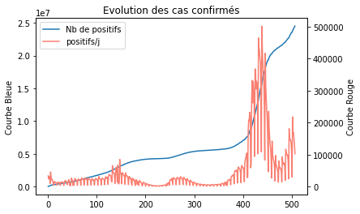
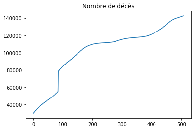
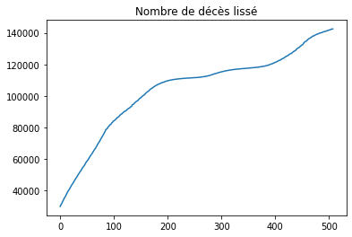
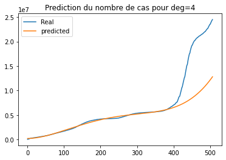
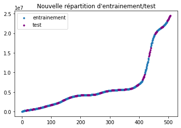
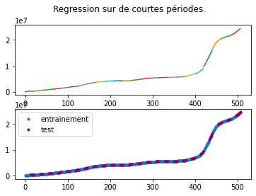
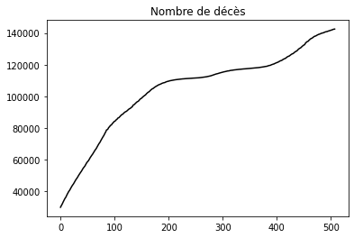
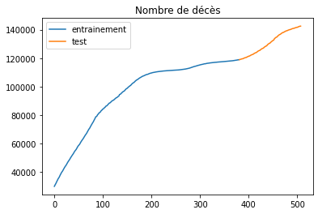
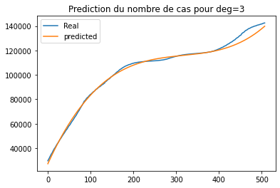

# Rapport de Projet IA

Louis Descamps 

--------------

## Sujet 

Le but du sujet est de vérifier l'hypothèse suivante 

> Les performances des algorithmes de Machine Learning permettent de modéliser une tendance d'une manière efficace. 

Pour cela nous tenterons de modéliser les tendances du covid19 et de prédire son évolution au sein d'une population. 

Autrement dit notre but est de créer une IA qui peut : 

- Prédire le nombre de décès à venir liés aux Covid. 
- Prédire le nombre de nouveaux cas positifs. 

Nous travaillerons avec un $\Delta T$ d'une journée (24h). 

# Choix et Analyse des données 

On travaillera sur l'ensemble du territoire français en exploitant les données de [synthèses des indicateurs](https://www.data.gouv.fr/fr/datasets/synthese-des-indicateurs-de-suivi-de-lepidemie-covid-19/?reuses_page=1#community-reuses) du ministères de la santé.

On pourra lire la description des données sur le site de téléchargement, voici un rapide survol : 

Les bases de données diffère par la prise en compte de la région et du département. 

**Contexte : ** Chaque données est entourée de son contexte avec les champs `date`, `dep` (Département) et `reg` (Région). 

**Situation Hospitalière :** On note 3 catégories majeures `hosp` (pour les hospitalisations), `rea` (pour les patients en réanimations), `rad` (pour les retours à domicile suite à une entrée à hôpital). Ces trois catégories sont complétées par `incid_***` Le nombre de nouveaux admis/relâchés en 24h. 

**Décès :** Notamment `dc_tot` (le nombre de décès totaux dû au Covid19 dans des établissement de santé). 

**Tests :** Qui inclue notamment les cas confirmés `conf`. 

**Indicateurs mathématiques :** Ceux qui pourraient nous être particulièrement utile étant `R` le facteur de reproduction du virus, `TO` LA proportion d'occupation des services d'urgences par des cas Covid.  

---------

On travaillera sur la base de donnée qui ne prends pas en compte les départements et les régions. On mettra au point notre algorithme sur cette base de données. On pourra utiliser les données par région pour vérifier la capacité de prédiction de l'algorithme dans un second temps. 

On gardera uniquement huit colonnes.  `date`, `TO`, `R`, `hosp`, `rad`, `conf`, `conf_j1` et `dc_tot`. On travaillera sur ce jeu de données plus petit pour simplifier les calculs et permettre un meilleur apprentissage de l'algorithme. Beaucoup de ses données sont absentes en parties de la base de données. On utilisera `conf_j1` pour calculer `conf` avec la formule `conf(n) = conf(n-1)+conf_j1(n)`. On utilisera  `dchosp` et `esms_dc` pour calculer `dc_tot` avec la formule `dc_tot = dchosp + esms_dc`. 

Les manquements dans la base de données ne permettent pas de commencer l'étude avant novembre 2020. 

-------

### Visualisation des données

On regarde l'allure des données afin de mieux préparer nos modèles mathèmatiques. 

#### Cas Confirmé 

On voit que la courbe qui sera probablement la plus simple à modéliser et prédire sera le nombre total de cas confirmé depuis le début de l'épidémie (en bleue). 

#### Nombre de décès

Le nombre de décès total saute brusquement entre le 4 et le 5 février 202, c'est la prise en compte des dècès en établissement externe aux hopitaux (exemple : ehpad). On va lisser leurs ajouts sur les 100 premiers jours pour éviter un saut si violent qui pourrait altérer l'apprentissage. Une fois lissé on obtient : 

La courbe comprends encore un point de discontinuité (de la dérivée) au même endroit que précément mais cette discontinuité est bien sera bien plus négligeable lors de l'apprentissage. 

--------

On crée une nouvelle base de donnée `dataframe_clean` avec ces modifications que l'on utilisera dans la suite. Elle contient 508 lignes et 8 colonnes. 

# Régression

La première modélisation que nous allons réaliser sera une régression. On travaille ici sur des données temporelles : le but est de prédire une partie de la courbe sur laquelle nous n'avons aucune valeurs expérimentale (le futur ne s'étant pas encore produit). La régression est très efficace pour créer une fonction continue a partir de donnée discrète hors ce n'est pas notre cas du tout. 

## Nombre de Cas 

Comme dit précédemment nous utiliserons la courbe en bleue afin d'entrainer notre modèle. On voit ici que l'on a un changement violent de tendance de la courbe bleue lors de la vague de janvier 2022 (qui corresponds à la sortie de la logique des confinements répétés du gouvernement). 

### Regression Naive 

On met en place une régression polynomiale (avec RIDGE) pour tenter de prédire la courbe. On utilise les 2/3 de premières valeurs pour tenter de prédire toute la fin de la courbe. 

On a du mal à avoir une prédiction correcte comme on l'avait prévue. La courbe ci-dessus a le meilleur score de toutes les courbes de prédiction possible (en changeant les degrés des polynomes) avec un score de test de -0,679. C'est une très mauvaise prédiction. 

En revanche, on peut probablement estimer le nombre de cas par régression sur de petites durées. 

### Regressions sur de courtes durées 

Changeons de paradygme et tentons de prédire pour une semaine (7jours) le nombre de cas en utilisant le nombre de cas des deux semaines passées. (On garde les proportions 2/3 d'entrainement et 1/3 de test.)

Voici la nouvelle répartition de nos batchs d'entrainement et de test des données. On utilisera uniquement les deux semaines (bleues) précédant une phase de test (violette) pour mettre en place un modèle et le tester sur la dite phase de test d'une semaine. 

On met donc en pratique la même solution que précèdemment et on obtient : 

Avec un score de précision de 0.9999/1.

### Conclusion du nombre de cas 

On peut créer un bon modèle qui peut prédire l'évolution des cas sur une courte période (1semaine) mais on est incapable de créer un système qui prédit l'évolution du nombre de cas sur le long terme. 

## Nombre de décès

Nous allons maintenant travailler sur le nombre de décès sur la même période. 

On risque d'être confronter à la même prolématique que précédemment, la prédiction risque d'être très approximative si l'on tente d'entrainer le modèle sur une longue période pour prédire une longue période. Vérifions le de suite. 

### Regression Naïve 

Nous allons donc comme précèdemment utiliser les 2/3 premières valeurs pour prédire le reste. 

On crée un modèle polynomial avec Ridge. On obtient des résultats correcte : 

On a un score de test de 0,64/1. Le problème étant qu'on peut imaginer qu'on a une mauvaise généralisation des données (puisque qu'on a une courbe qui tends vers l'infini). 

# Reseaux LSTM 

## Monovariable 

On met en place un réseaux avec une seule variable qui va tenter (comme précédemment) de deviner l'évolution du nombre de cas pour les 7 jours à venir selon le nombre de cas des 14 jours précèdent. 

On met donc en place un réseaux à trois couche avec en entrée 14 neuronnes et en sortie 7 neuronnes différents. 

Avec un peu de temps de calcul on obtient : 

![img](data:image/png;base64,iVBORw0KGgoAAAANSUhEUgAAAXQAAAEICAYAAABPgw/pAAAABHNCSVQICAgIfAhkiAAAAAlwSFlzAAALEgAACxIB0t1+/AAAADh0RVh0U29mdHdhcmUAbWF0cGxvdGxpYiB2ZXJzaW9uMy4yLjIsIGh0dHA6Ly9tYXRwbG90bGliLm9yZy+WH4yJAAAgAElEQVR4nO3deXgV5dn48e+dfSGEJOxkA4GwIxAExIUqKirFvS61al3QKm5ttdrFtf5KX1t99ZVqqVLcaYtL0SKgLFUUFFCQHQIECHsCWcienOf3x0zg5JDkTJJzcnKS+3NduTgzc8/MPZlwZ/LMzPOIMQallFLBLyTQCSillPINLehKKdVGaEFXSqk2Qgu6Ukq1EVrQlVKqjdCCrpRSbYQWdHUKEUkXESMiYR7zQ0Tk3yIy1W3eLSKy3G36uIj08UNOftluHfuZLSK/b+K6RkT6+jonL/uMFpEvReTSBmImiEiO2/RGEZnQhH2dLSJbm5iqagFa0IOciGSLSIWIdPaY/51dYNJ9uLvfA0uMMTPrCzDGdDDG7GzOTkRkmYjc7uvttlF/BZ4zxvzH6QrGmMHGmGXe4jx/QRljvjDGZDQtTdUSwryHqCCwC7ge+D8AERkKxPh6J8aYX/t6m6rxRCTUGFMNYIy5KdD5qNZDr9DbhjcB9//YNwNvuAeISLyIvCEiR0Rkt4j8VkRC7GWhIvInEckVkZ3ApXWs+5qIHBCRfSLyexEJrSsR96s6EblERDaJSJG93i/t+Qki8rGdyzH7c7K97BngbOAlu5nlpTq229Cx3CIiy+3jOSYiu0Tk4vq+cSIyQkS+tXP8BxDlsXyyiKwVkXwR+UpEhnk5FzXrXWr/lVQoIntF5IkGYieISI6I/No+B9ki8mO35bNF5GURmS8ixcAPRKSniLxnfw92ich9bvHR9jrHRGQTMNpjf9kiMtH+HGrvd4f9PVgjIiki8rkdvs4+D9fW0XQz0P5rKt9uxpnikfMMEfmPvd2vReQ0J9871QzGGP0K4i8gG5gIbAUGAqFADpAGGCDdjnsD+DcQB6QD24Db7GV3AVuAFCARWGqvG2Yv/wDrT/tYoCvwDXCnvewWYLlbPgboa38+AJxtf04ARtqfk4CrsP6KiAP+BXzoto1lwO0ex+m+3YaO5RagErjD/l78DNgPSB3fuwhgN/AgEA5cba/7e3v5COAwMMbe1s329zuynnPhnuMEYCjWRdMw4BBweT3rTQCqgOeASOBcoBjIsJfPBgqA8fb2YoA1wGP2MfQBdgIX2fHTgS/sc5kCbAByPH9m7M8PAeuBDECA4UCS5/G45Zljfw4HsoBf2zmcBxR55JwHnIHVEvA2MCfQ/1/a+lfAE9CvZp7AkwX9t8AfgEnAp/Z/ImMXvFCgAhjktt6dwDL78xLgLrdlF9rrhgHdgHIg2m359cBS+/Mt1F/Q99j76ejlGE4HjrlNL6Oegu7gWG4BstyWxdjrdq9jv+fgUeyBrzhZ0F8GnvZYZytwbj3HUasAeiz7X+D5epZNwCrosW7z/gn8zv48G3jDbdkYYI/HNh4F/m5/3glMcls2lfoL+lbgMifHQ+2CfjZwEAhxW/4u8IRbzq+6LbsE2BLo/y9t/Uvb0NuON4HPgd54NLcAnbGuqHa7zdsN9LI/9wT2eiyrkWave0BEauaFeMTX5yqsXzTTReR74BFjzAoRiQGex/rlk2DHxrm3DTfA27GAVWgAMMaU2Hl3qGNbPYF9xq44btuqkQbcLCL3us2LsNdrkIiMwbpSHmKvE4n1l0h9jhljij3ycN+P+/c7DegpIvlu80Kxrsqh4fPpKQXY0cDy+vQE9hpjXB77qfM8ACXUfQ6UD2kbehthjNmNdXP0EuB9j8W5WE0JaW7zUoF99ucDWP+x3ZfV2It1hd7ZGNPJ/upojBnsIKdVxpjLsJppPsS66gT4Bdaf+GOMMR2xrpTB+pMfrCvD+ng7lsY4APQSt99UnHrsz7gddydjTIwx5l0H234HmAekGGPigVc4eXx1SRCRWI889rtNu39P9gK7PPKKM8Zc4nZc9Z1PT3uBprRt7wdSau5duO2nKedB+YgW9LblNuA8jys97KvefwLPiEiciKQBPwfeskP+CdwnIskikgA84rbuAWAR8GcR6SjWs+inici5DSUiIhEi8mMRiTfGVAKFQM3VXBxQCuSLSCLwuMfqh7DahU/h4FgaYwVWU8d9IhIuIlditfnW+Btwl4iMEUusfbMzzsG244CjxpgyETkDuMHBOk/a37ezgcnUf0X/DVAkIr+yb4CGisgQEam5+flP4FH75nMycG892wF4FXhaRPrZxzhMRJLsZfWeB+BrrKvuh+3v3QTgh8AcB8ep/EQLehtijNlhjFldz+J7sW607QSWY11BzrKX/Q1YCKwDvuXUK/ybsJoNNgHHgLlADwcp/QTIFpFCrBuvNU9u/C8QjXW1vRJY4LHeC8DV9lMaLzbyWBwzxlQAV2K1ux8FrsXt2O3v5R3AS1jHnWXHOnE38JSIFGHdvPynl/iD9j72Y91AvMsYs6WevKuxCv7pWH+V5WIV5ng75Ems5o9dWL+M32xgv8/ZuS3C+qX7Gta5AXgCeN1+iuVHHjlUYBXwi+39/wW4qb6cVcuQ2s2HSqmWZl/dvmWMSQ50Liq46RW6Ukq1EVrQlVKqjdAmF6WUaiP0Cl0ppdqIgL1Y1LlzZ5Oenh6o3SulVFBas2ZNrjGmS13LAlbQ09PTWb26vifslFJK1UVE6n3zV5tclFKqjdCCrpRSbYQWdKWUaiO8tqGLyCys14wPG2OG1LFcsF7VvgSrb4dbjDHfNiWZyspKcnJyKCsra8rqqg5RUVEkJycTHh4e6FSUUn7m5KbobKy+LDy7ZK1xMdDP/hqD1Yf0mKYkk5OTQ1xcHOnp6dTuAE81hTGGvLw8cnJy6N27d6DTUUr5mdcmF2PM51gdF9XnMqzO940xZiXQSUScdNx0irKyMpKSkrSY+4iIkJSUpH/xKNVO+KINvRe1O9PPoXYn9yeIyFQRWS0iq48cOVLnxrSY+5Z+P5VqP1r0pqgxZqYxJtMYk9mlS53PxSulVJtVVe3i/83fzLq9+d6Dm8AXBX0ftUdHSaYdj1qSnp5Obm5uoNNQSrVCe46WMPPznWw7VOSX7fviTdF5wDQRmYN1M7TAHuUm6NUMvBoSok93KqWazhjD+X/+L327WsOq1vzra14rlYi8izVUV4aI5IjIbSJyl4jcZYfMxxo5Jgtr5Ju7/ZJpC8nOziYjI4ObbrqJIUOG8PTTTzN69GiGDRvG44+fHCnt8ssvZ9SoUQwePJiZM2cGMGOlVGtWVlnN4aJyduYWs2jTIQBO81NB93qFboy53styA9zjs4xsT360kU37C326zUE9O/L4D72Obcz27dt5/fXXKSwsZO7cuXzzzTcYY5gyZQqff/4555xzDrNmzSIxMZHS0lJGjx7NVVddRVJSktdtK6XalwG/W0BoyMmHE7rGRdIxyj/vhWhbQh3S0tIYO3YsixYtYtGiRYwYMYKRI0eyZcsWtm/fDsCLL77I8OHDGTt2LHv37j0xXymlAHKOlbA7zxqvvdp1ctyJ9KRYv+0zYL0teuPkStpfYmOtb7gxhkcffZQ777yz1vJly5bx2WefsWLFCmJiYpgwYYI+662UquWsPy6tc35KYozf9qlX6A246KKLmDVrFsePHwdg3759HD58mIKCAhISEoiJiWHLli2sXLkywJkqpVoLY0ytK3JPqX4s6K32Cr01uPDCC9m8eTPjxo0DoEOHDrz11ltMmjSJV155hYEDB5KRkcHYsWMDnKlSKtC+3XOMj9btZ8uBIrLtppa6pCX5r6AHbEzRzMxM4znAxebNmxk4cGBA8mnL9PuqlP/kHS/nX2tymP7JFkfxG5+8iNjIpl9Li8gaY0xmXcv0Cl0ppZqovKqae975lpU7G+ruynLVyGRChGYVc2+0oCulVBN8vu0IN836xnH8s1cPIyTEv30raUFXSqlGqHYZXvnvDlbuzHMU/9ZtY0jqEOH3Yg5a0JVSqlEWbz7Eswu3eo0b0zuRymoXY/okEh7aMg8UakFXSikHKqtd9PvNJ/SMj3IUf+e5fThvQDc/Z1WbFnSllPLii+1HKK90AbC/oOGXCB+9eACpiTH8IKNrS6RWi75Y5EfLli1j8uTJAMybN4/p06fXG5ufn89f/vKXE9P79+/n6quv9nuOSqmGGWP4yWvfcPsbq73G9uoUzfkDu3Hx0B4BGVxGr9CboLq6mtDQ0EatM2XKFKZMmVLv8pqCfvfdVmeVPXv2ZO7cuc3KUynVNIeLyigpr2ZdTj4lFdWO1unVKZovHznPz5k1TK/QPWRnZzNgwAB+/OMfM3DgQK6++mpKSkpIT0/nV7/6FSNHjuRf//oXixYtYty4cYwcOZJrrrnmRPcACxYsYMCAAYwcOZL333//xHZnz57NtGnTADh06BBXXHEFw4cPZ/jw4Xz11Vc88sgj7Nixg9NPP52HHnqI7OxshgwZAlhjrf70pz9l6NChjBgxgqVLl57Y5pVXXsmkSZPo168fDz/8cAt/t5RqW/bnl7J062HOeGYxE/60jPvnrOXR99c3uM7pKZ3I6BbHs9cMa6Es69d6r9A/eQQONvyNbLTuQ+Hi+ps9amzdupXXXnuN8ePHc+utt55oCklKSuLbb78lNzeXK6+8ks8++4zY2Fj++Mc/8txzz/Hwww9zxx13sGTJEvr27cu1115b5/bvu+8+zj33XD744AOqq6s5fvw406dPZ8OGDaxduxawfrHUmDFjBiLC+vXr2bJlCxdeeCHbtm0DYO3atXz33XdERkaSkZHBvffeS0pKSl27VUrV43h5FSt35PGzt9dQWe397fmBPToyqEdHHp8yiA4RYS3ySKITrbegB1BKSgrjx48H4MYbb+TFF18EOFGgV65cyaZNm07EVFRUMG7cOLZs2ULv3r3p16/fiXXrGvxiyZIlvPHGGwCEhoYSHx/PsWPH6s1n+fLl3HvvvQAMGDCAtLS0EwX9/PPPJz4+HoBBgwaxe/duLehKOVRV7WLZ1iO8tnwXKxw8V96/WwfCQkKYf//ZLZBd4zkq6CIyCXgBCAVeNcZM91ieBswCugBHgRuNMTnNyszBlbS/eN7MqJl271b3ggsu4N13360VV3N13ZIiIyNPfA4NDaWqqqrFc1AqGK3ZfYxFmw7y1//u9BqbkhhNzrFSFj14LoHq/8oJJ0PQhQIzgIuBQcD1IjLII+xPwBvGmGHAU8AffJ1oS9qzZw8rVqwA4J133uGss86qtXzs2LF8+eWXZGVlAVBcXMy2bdsYMGAA2dnZ7NixA+CUgl/j/PPP5+WXXwasG6wFBQXExcVRVFT3wLFnn302b7/9NgDbtm1jz549ZGRkNP9AlWqHjhZX8OmmQ1z18ldei3nNSEOfPnguO565BDj1gq81cXJT9Awgyxiz0xhTAcwBLvOIGQQssT8vrWN5UMnIyGDGjBkMHDiQY8eO8bOf/azW8i5dujB79myuv/56hg0bdqK5JSoqipkzZ3LppZcycuRIunat+znUF154gaVLlzJ06FBGjRrFpk2bSEpKYvz48QwZMoSHHnqoVvzdd9+Ny+Vi6NChXHvttcyePbvWlblSypnc4+WMfPpT7nDwCCLAv+8Zz8YnLyIqPLTVtJM3xGv3uSJyNTDJGHO7Pf0TYIwxZppbzDvA18aYF0TkSuA9oLMxpt5GqdbafW52djaTJ09mw4YNAc3Dl1rD91WpllZZbb0I9LcvdhITHsqcVXsJDw1h/b4Cr+s+OLE/Fw/tTv9ucf5Os9FaovvcXwIvicgtwOfAPuCUhzdFZCowFSA1NdVHu1ZKqZOOFldwqLCMn721hmMllRSUVnpdp2tcJBcN7s5lp/dk04FCrj8jtcX6X/ElJwV9H+D+2ESyPe8EY8x+4EoAEekAXGWMyffckDFmJjATrCv0JubsV+np6W3q6lyp9mJPXgmfbT7EnxZtdfwy0Nn9OvPAxP4M7BFHTIRVDjPTE/2Zpl85KeirgH4i0hurkF8H3OAeICKdgaPGGBfwKNYTL01ijGnVNx2CTWu+I69Uc7lchl15xfxh/haWbDlEA0N5nnD9GakkxIRz3/n9CA8NOXHjsy3wWtCNMVUiMg1YiPXY4ixjzEYReQpYbYyZB0wA/iAiBqvJ5Z6mJBMVFUVeXh5JSUla1H3AGENeXh5RUc56h1MqWLhchrU5+Vz5l68cxYeFCNOvGkZZZTU3jk3zc3aB06rGFK2srCQnJ4eysoZ7M1PORUVFkZycTHh4eKBTUarJVu7MIyEmggf+sZbBPTsyd43z11zevO0MosNDg7opxV3QjCkaHh5O7969A52GUirACkorKSqrZNbybCqrXby5cveJZZsPFNa7XliI8MSUwZRWVHPpsB7sOVrC2D5JLZFyq9CqCrpSqn3buL+AL7bn8n+Lt1Ps8MbmqLQELhzUjUuG9iA5IbpWc23PTtH+SrVV0oKulAoIl8sgAoeLyvnvtiM8PPd7R+slxkYwZXhP0pJi+OHwnsRHhwflI4b+oAVdKdUiau7XvfrFLrrFR3Hfu99xWpdYdhwpdryNedOsDvGGJXfyS47BTgu6UsqvNu4vICI0hB++tJzhyZ34etfRE8vqK+YDuscRGxnGY5MHcbCwjLF9kigsrSQlMaal0g5KWtCVUn7xn+8PcKiwjKc+3nRinnsxr8sTPxxEQmwEFw/pQUSY1Ywy3F4WH61PanmjBV0p5VPTP9nC+9/mcLio3FH8jWNTuXRoT8b0TgyKDrBaMy3oSqkmyz1eTmFpJc/8ZzO9O8fy2eZDZOeVOFr3nTvG0L1jFH26dPBzlu2HFnSlVKOtyj5Kfkml425oAZ6+bDAFpZWc2bczISKcnqI3Nn1NC7pSyrFPNx1CgNsbUcg/uf9sIsJCOE2vxP1OC7pSyqsvth8hVMTxFXlUeAgf3D2ePl1iiQwL9XN2qoYWdKVUvTbuL6CiysVPXvvGUXyXuEheuO50zjyts58zU3XRgq6UqtelLy53FBcXGcbDFw/gJ224J8NgoAVdKXXCxv0FfLTuAEeLy/k+x/tQbTXWP3mRH7NSTmlBV0qx88hx/rRoK/PXH3QUP/WcPiTFRtC/exx9Osf6OTvllBZ0pdqxymoXb63czdtf7yHr8HGv8Y9NHkRUeCg3jNExgVsjLehKtVNFZZW8sWI3zy7c6jV24sBu5Bwr4afj03U0sVbMUUEXkUnAC1hD0L1qjJnusTwVeB3oZMc8YoyZ7+NclVI+sievhHOeXeo4/unLB9Mjvn31LR6MvBZ0EQkFZgAXADnAKhGZZ4zZ5Bb2W+CfxpiXRWQQMB9I90O+Sqlm+vfafexx+Hr+AxP7ccGgblrMg4STK/QzgCxjzE4AEZkDXAa4F3QDdLQ/xwP7fZmkUso3SiqquH/OWq9xIQKxEWFcOzpFi3kQcVLQewF73aZzgDEeMU8Ai0TkXiAWmFjXhkRkKjAVIDVVb6oo1ZL+tXovVS5ng8JfNLg7L984ys8ZKV/z1U3R64HZxpg/i8g44E0RGWKMcbkHGWNmAjMBMjMznf1kKaV84iGHQ7yN6Z3IryYN8HM2yh+cFPR9QIrbdLI9z91twCQAY8wKEYkCOgOHfZGkUqrpSiuqqahyeQ/EGkTiH3eO83NGyl+cFPRVQD8R6Y1VyK8DbvCI2QOcD8wWkYFAFHDEl4kqpRpn+fZc9h4r4dH31xPqcOCICwZ183NWyp+8FnRjTJWITAMWYj2SOMsYs1FEngJWG2PmAb8A/iYiD2LdIL3F1IwIq5QKiBtf+/rE5+oG2s5/lJnMeQO6kZwQTf9ucS2RmvITR23o9jPl8z3mPeb2eRMw3repKaWa4tmFW5ixdIfj+P+5erj3IBUU9E1RpdoYp8X8vZ+dSVJshJ+zUS1JC7pSbUTW4SJe+e9Ox/Gj0hL8mI0KBC3oSrURU99Yw87cYq9xj1w8QK/M2ygt6Eq1AfvzS8krrnAUe9tZvQkPDfFzRioQtKArFeT+vXafo9f5a2gxb7u0oCsV5JZtdfbKx9u3j6Ff1w5+zkYFkv6qViqIrdubT+7xckexfbrE0rVjlJ8zUoGkV+hKBak1u49y1csrHMd37hDpx2xUa6AFXakgteOw9ydawBo27trRKdp23g7oGVYqSB0vr3IUlxgbQWykXru1B3qWlQoy5VXVZPx2AT3inbWH9+ykA1S0F1rQlQoyucet580PFJQ1GDe+bxLXjk7ljN6JLZGWagW0yUWpIFNa4ayppWtcFFOG9/RzNqo10YKuVJA5Xl7tKC42MtTPmajWRptclAoi/1y1l6Mlzl7x1xuh7Y+ecaWCwDtf78FlDL/9cIOj+OSEaG4ck+bnrFRrowVdqSDw6w/WO4q7cmQvpv2gL3266Cv+7ZGjNnQRmSQiW0UkS0QeqWP58yKy1v7aJiL5vk9VqfbH5TI0ZjTH5350uhbz1qa6CipKYP1cWPWqX3fl9QpdREKBGcAFQA6wSkTm2cPOAWCMedAt/l5ghB9yVardmTJjOdsOHncUe3pKJz9noxrl2G7Yvgi2LYSsT0/OH32733bppMnlDCDLGLMTQETmAJcBm+qJvx543DfpKdW+bdhX6Cju/bvPpK/2pBg4laUQEgZfvQgdk+GDqRAeA5UlLZqGk4LeC9jrNp0DjKkrUETSgN7AknqWTwWmAqSmpjYqUaVU/Uam6nByLarkKIRFwaq/Qfdh8Obl0GUAHNlyMqa+Yl6QA/HJfknL1zdFrwPmGmPqfFDWGDMTmAmQmZnpvGFQqXZm26EiNu4vCHQaqkbhASg9Cru/Alc1LPgVJJ4GR90G5HYv5g15fjA8ng8iPk/TSUHfB6S4TSfb8+pyHXBPc5NSqr278PnPHcX9IKMLY/sk+TmbdsQYOLwJYpJgzesQHgWfPgahkVDt0e+8ezFvrH1rIDmzebnWwUlBXwX0E5HeWIX8OuAGzyARGQAkAM47aFZKNcvff3pGoFMIXoUHIDIOvp8DvUbBrElw+g2wetapsZ7FvLn8cHUODgq6MaZKRKYBC4FQYJYxZqOIPAWsNsbMs0OvA+aYxjxjpZRS/lZWCMVHoOgAFOfChvcgOgG+fR06pUL+npOxdRVzf6hsuGO1pnLUhm6MmQ/M95j3mMf0E75LS6n26YvtR3j+022BTiN4ZX9p3Zz8/FnokgEfP3DqzUp37sW8JVU4G5yksfRNUaVakfvnrOVosfe+Wv7fFUPpldCO+znP2wERsbDuXeg5At64DAZfARs/ODXW6c3KllTh7N2CxtKCrlQrUuKwa9wrR/YiKrwd9KZYXWk9Ili4D45shc0fQfFhyFl1amxdxby18tPz6VrQlWpFyipdjuLabDE3BrK/gLiesPDX1k3LDXMDnZXvxKeCAKERftm8FnSlWoEjReU8117bznevsF60mTUJMi62XtZpS06/EboPhdSxkJBm3ZD1Ey3oSrUCT360kY+/P+A17vazetM5LrIFMvKjooOAWC/n9BoFi357clkwF/PkMyDnG/jxe9az7MOuBeOCjj1aLAUt6Eq1AsXlztrOfzQ6hf7d4vycjZ/sWArHsq0nT2oEU7u3p6HXwJb5cOsCOLDWuhJ3VUJYJPSbGJCUtKAr1QqUVjobVi4+OtzPmfhQVQXkboOt82HpM4HOpnniU2Dw5RDbBTIusW7WdsmAEPteRo9h1r8hgf3rSQu6UgF2uKiM0oo2VNAry2DNbDi6E775a6CzcSapH+Rth/Mfhy3/gUnTradpeo0CCYUOXQKdoSNa0JUKoFXZR7nmFee9ZbTqp1uqKqx28ZDw1lvIO/e3/mq48PdwYB2c9zvY/aXV3l16DGI7w9k/D3SWTaYFXakAWrvH2eBeT18+hAn9W+lVossFH/7MelKlpV6db0ifH8DOpTDxSatIp59tPVkSkwAxnSGqY+34BHvs1djOLZ+rj2lBVyqAyhy2nXfpEEFKYoyfs2mCz5602pK/n9Py+x4wGbZ8DDe+B1lL4JxfWi8fpYwBUw2hQdA85WNa0JUKoLIqZwU9OqKV/VddNwei4mH5cy2zv7SzIG2c1ZlW2njrccCE3hBqf1/62k+VpI2zV3A0XHKb08p+SpRqX5y+GRob0Urazg9ugPIi+OBO/2y/5qr7lvnWTdX+k6z5QXJTMtC0oCsVAMfLq5jyf8sJDXHWL3bHQD/dUllmFfJXxvt2uxmXQPZyuG2R1Vwy+PKTy9J9vK92QAu6Ui3sD/M3U1ZZzc5c712oXj0qmWHJ8fQL9ADQ714LO5f5Zlsde8EFT1k3KtPPhjC7X5OuA32z/XZMC7pSLaiq2sVfP9/pNS4hJpyLBnfnN5cOJC4qgFfn2cth2XSrw6ymik6Ajslw0TNWG3hib9/lp2rRgq5UCyoorXQU16dLB6ZfNczP2TTAVQ17VsCHd0P+7qZt40dvWv22nHGH34ZcU7U5KugiMgl4AWsIuleNMdPriPkR8ARggHXGmFPGHVWqPfts0yEKy5wV9E6BbjP/6kX47InGrRPb1Xq78u6voSRP28ADwGtBF5FQYAZwAZADrBKRecaYTW4x/YBHgfHGmGMi0tVfCSsVrG5/Y7WjuC5xkdw/sZ+fs6lH+XGYdy9UNWLMy47JUJgDt3wMUZ0grpv/8lMNcnKFfgaQZYzZCSAic4DLgE1uMXcAM4wxxwCMMYd9nahS7cWq3wSmpz4ANn0IG993FhsWZRX+q151e/5bBZKTgt4L2Os2nQOM8YjpDyAiX2I1yzxhjFnguSERmQpMBUhNTW1KvkoFJZfLBDqFhpUVwvQUOO185+tMfh5O15bV1sRXN0XDgH7ABCAZ+FxEhhpjanVUYYyZCcwEyMzMbOU/4Ur5xuYDhY4GfgaIiwrAcwolR6H4iPV5x2Lv8SN+Ape95N+cVJM4+enZB6S4TSfb89zlAF8bYyqBXSKyDavA1zGSq1Lty8UvOH/k7+GLMvyYST3+p7fVC6E3kR3h4V0n+wBXrY6Tgr4K6CcivbEK+XWA599ZHwLXA38Xkc5YTTDeH7ZVSp2QPf3Slt1hce7JDlAf4zUAABnaSURBVKxyvYxn+vPNVpt5qD7p3Jp5PTvGmCoRmQYsxGofn2WM2SgiTwGrjTHz7GUXisgmoBp4yBiT58/ElVLN9OxpEOFlOLtbF1k3Pjv2bJmcVLM4+nVrjJkPzPeY95jbZwP83P5SSgElFVWUOByJqEWVH7d6KwSoKKo7Ztw0yFkFqZ7PP6jWTP9+UspPfvh/y9lxxHt/LQCnp3TyczZunhsE5QUNx5z3WwiPbpl8lM9oQVfKT5wW829+cz5xkS30ZqgxDRfzH70B0YlazIOUFnSlAqxrXFTL7GjubbBhbt3LkkdbTSwpYyCue8vko3xOC7pS7UV9xRysEX9u/6zlclF+oQVdKR9btzefeev2BzqNk7YugC/+XPeylLGQdBqM8dMIRKpFaUFXyscum/Glo7hHLh5AWksM/Pz+1PrbzTulwuV/8X8OqkVoQVcqQKae3YcQh0PQNUnJUfjuLawerT2Ex8DF/wMDf+i//asWpwVdqQDxazEHWPgbWPdO3cu6D4WRP/Hv/lWL04KulI8YY1rPi0T5e8FVVfeyWxdB5wD1t678Sgu6Uj7y5srdPPbvjYFOA7IWw1tXQmKfU5fFJOnbn22YFnSlfOTD7zw7Ia3bO3eMISXBjzdD87Ksf4969I83bbU1opBqs7SgK+UjZZUuR3GndelAt45+eJmoqgI+uh8Se9e9XJtZ2jwt6Er5SFmls/Zzvw1icfD7um+C3rcWxM83YFWroAVdKR/YnVdMqcOCHh3uhwEiCvad7EHRU31X7KrN0YKuVDMUlFayZMshHvzHOsfriK+vll3V8PygU+fftRwqnHUQptoGLehKNdHuvGLOfXaZ4/glvziXuCg/9KpYcbzu+V0HQ0iI7/enWi0t6Eo10YZ9hY7i7vnBaUwZ3os+XTr4PokVf4HohNrzLn8Fjh/SYt4OOSroIjIJeAFrCLpXjTHTPZbfAjzLycGjXzLGvOrDPJVqVQ4XlnGosMxRbI/4aDK6exnqrakWPnrqvJ4joOsA/+xPtWpeC7qIhAIzgAuAHGCViMwzxmzyCP2HMWaaH3JUqlWpqnZx/nP/Jcrhzc2hveJ9n0Rl6anzohOhugLik32/PxUUnFyhnwFkGWN2AojIHOAywLOgK9Uu5JdWUlRWRVFZPa/W28b1SWL6VUNJS4r1fRJ/yji1B8ULfw8jfuz7famg4aSRrRew1206x57n6SoR+V5E5opISl0bEpGpIrJaRFYfOXKkCekqFXj5JRWO4hJiw/1TzKHu7nAT0v2zLxU0fHVT9CPgXWNMuYjcCbwOnOcZZIyZCcwEyMzMrKNPT6Vat6c+2oTLOPvR7dwh0vcJ7Prc6njLXeatMP4BSEjz/f5UUHFS0PcB7lfcyZy8+QmAMSbPbfJV4H+an5pSrc+sL3c5ivvp+HQemNjf9wm8Xkf/5WHRWswV4KygrwL6iUhvrEJ+HXCDe4CI9DDGHLAnpwCbfZqlUq1AVbWzvlrio8N5/IeDfbtzVzVUldeeF9MZzv0VnH5D3euodsdrQTfGVInINGAh1mOLs4wxG0XkKWC1MWYecJ+ITAGqgKPALX7MWakWtz+/lGMO287jo/3w8tD8X8LqWbXnhUfDmKm+35cKWo7a0I0x84H5HvMec/v8KFDHA7FKtQ1nTl/iOPba0XU+E9A8nsW8Uxpcpa96qNr0TVGlfGjDkxcRG+HDzrfy98Lad6BXJuxbfXL+A9/7bh+qzdCCrlQDXC5T1xDL9eoQ6eP/UvN/CdsW1J43XNvMVd20oCvVgGv+uoI1u485is3o5uPX+13VEOLxX/R3eRDih+53VZugBV2pBjgt5h9NO4vURB8OK7frC3h98qnzQ/W/rKqf/nQo5QNDk33cX8vuL2tP3zRP3wRVXmlBV6oOJRVV5BY5e0zRp1wu+PplCPN4y7TPuS2fiwo6WtCVqsNNr33DaofNLX06+7C/lt3LYeGvT04n9oGxd/tu+6pN04KuVB2cFPPwUGHN7y4gItRHA0kYc+q4oPd+qwM8K8e0oCvVRAkxEXT01ZBylWXwTLdT52sxV42gBV0pN6UV1azefdRrXERYCAkxEb7bcUlu7en711lvgyrVCFrQlQKqXYZlWw/z9y+zWZ6V6zV+TO9EkmJ9VNBXvQoHN9SeF9VJr85Vo2lBVwp45b87eHbhVq9xyQnR5Bwr5c3bxmAc9ovu1X9+cfLzqFtg2HUQ3ck321btihZ0pYBN+wsdxb1282j6de0AgDT3Crro0Kk3QQdOgbRxzduuare0oKt2b9uhIsdd43buEEFIiI+aQv7sMQDGkKuhtz5vrppOC7pq11ZnH+XqV1Y4ju/kyxuh7s7+JZz/O/9sW7UbWtBVu7bRYVPLM1cM4ZIhPQj1xdX5wt/Aipdqz8v8afO3q9o9Leiq3TLGUFBa6Sg2KTaCBF891eJezFPHwa0L6o9VqhEcveImIpNEZKuIZInIIw3EXSUiRkQyfZeiUr5XXF5F70fn89yn2xzFJyf4oCfFnDXw90tqzzvr583frlI2r1foIhIKzAAuAHKAVSIyzxizySMuDrgf+NofiSrlS/vzSx3FXTS4GzeNS2dILx/0pvjqebWnf3v41E64lGoGJ1foZwBZxpidxpgKYA5wWR1xTwN/BMp8mJ9SflFY5qyppWtcFOP7dm7ezipKIHt57XnjH9BirnzOSRt6L2Cv23QOMMY9QERGAinGmP+IyEP1bUhEpgJTAVJTUxufrVI+8M9VezlU6Oy6Iz7aB321LHgEvn395PS930LSac3frlIemn1TVERCgOeAW7zFGmNmAjMBMjMzffSanVLOGWN4+D3vAyyHCPTp0oEbxjTzwsPlgsObT07H9dRirvzGSUHfB6S4TSfb82rEAUOAZfabc92BeSIyxRjjNky5UoFXVF7lKC6je0c+uf/s5u0sazG8deXJ6YufheHXNm+bSjXASUFfBfQTkd5Yhfw64MSw48aYAuBEI6OILAN+qcVctTa//XA9VdXO/jDs1Smq+TvcsaT29Jipzd+mUg3wWtCNMVUiMg1YCIQCs4wxG0XkKWC1MWaev5NUyhfeWrnHUdyDE/vzk3HN6Lr2+BH4U9+T0xmXwIW/b/r2lHLIURu6MWY+MN9j3mP1xE5oflpKBc79E/s1bwPZn9eevv7d5m1PKYf0TVHV5h0sKHP8RmizVFfBC8OhMOfkvJs/8v9+lbJpQVdt3tg/LHYc+9Px6U3f0dEdtYv5rw9AhA/eMFXKIS3oStm2PD2p6QM+z70VNrx3cvryl7WYqxanBV21WbvzitmZW+w4Pio8tGk7qiytXcynrYHOfeuPV8pPtKCrNqWorJJth47z7jd7mLsmx/sKQI/4KC4a3L1pO1z8FHzx55PTk6ZrMVcBowVdtRn/WLWHX7233nH8/7tiKNERIVwxIrnpO3Uv5je+B30nNn1bSjWTFnTVZry3Zp/3IOCDu88kMTaCtKTYpu/si+dg8ZMnpy/7C5x2ftO3p5QPaEFXQe9IUTl3vLGarQeLHMUP6RVPeFNvftZwL+bXvA6DL2/e9pTyAS3oKui9+80e1u7N9xr34MT+JMSGN6+Yr3wFFvzq5PTti6HXqKZvTykf0oKugtqKHXmOB6s4q18So9ISm7YjY+DI1trF/Nq3IFkH51KthxZ0FbSyDhdx/d9Weo0LDRGqXYbTunRo+s6WPgOfP3ty+oEN0Cml/nilAkALugpKucfL2XbouKPYByf24+4JfQkJkcbvqKwAZk6AoztPzrt9iRZz1SppQVdBp9plyPz9Z47jR6YmNK2Ylx6Dv513spgnj4bbne9XqZamBV0FHafDx43pncgzVwylb9cmNLUc3gx/GXty+qyfw4RHG78dpVqQFnQVVM78w2LHr+gP7RXf+GJeVQHPdAPjOjnvipk60pAKClrQVVCoqHLhMob9Bd6vzkXghetGMKmxr/N/8WfrVf4aHXvBgxutDSoVBBwVdBGZBLyANWLRq8aY6R7L7wLuAaqB48BUY8wmH+eq2pGDBWWs2X2Mo8XlbDpQxAff5VDpcPi4CwZ2Y8rwns53tn8tvH0NFB8+Oe+yGTDixkZmrVRgeS3oIhIKzAAuAHKAVSIyz6Ngv2OMecWOnwI8B0zyQ76qjSurrGblzjwe+Mda8ku8D0oxLDmernGRDEvuxIjUTnSIDGNgj47OdlZeBIufhm/+enJefApMWwXh0U08AqUCx8kV+hlAljFmJ4CIzAEuA04UdGNMoVt8LODsUkopm8tl+GzzIf69bj//+f6A1/jkhGjKKquZN+2spuwMvnsDPrq/9vx7voEuGY3fnlKthJOC3gvY6zadA4zxDBKRe4CfAxHAeT7JTrV5xhgWbDjIhv0FzFi6w2t8/24d2HboOF88/ANMYy8bXNXw9Suw8Ne1518zGwZdrm3lKuj57KaoMWYGMENEbgB+C9zsGSMiU4GpAKmpqb7atQpSc77ZQ0lFNU997P12S69O0ezLL+XDe8YTFRaKiDivv2WFMOcGyP6i9vyJT8KZ90FIMzvqUqqVcFLQ9wHur8Ul2/PqMwd4ua4FxpiZwEyAzMxMbZZpJ6qqXRhgwYaDhIUIn20+TFR4CG9/vcfrun06x1Je5eKDu8+ka8co5zstOgRfvwzLnz912aXPwahbIKSJIxQp1Uo5KeirgH4i0hurkF8H3OAeICL9jDHb7clLge2odm/v0RI2HShk4YaDbD1UxM4jxZRWVntd79z+XbhkaHe+zyngFxdmkBgb4X1nLhcc3mg9drh9Ud0xN82DPuc28iiUCh5eC7oxpkpEpgELsR5bnGWM2SgiTwGrjTHzgGkiMhGoBI5RR3OLavuMMezOK2HP0RJmLM3i611HAatpuqH27jN6J9K3aweuHpVM364d6BgVDsC1o73ssKIEdiyBefdC6dG6Yy79Mwy+EmKa2MuiUkHEURu6MWY+MN9j3mNun+8/ZSXVblRUuXhjRTaFZVW8uPjUP87qK+av3DiKsBBh4qBuDndUDHlZsOBR2LMSTB1X+8mjYfQdMOxHepNTtTv6pqhqlP35pUSFhzJjaRbJCdHMW7efgpJKduYWe1138rAe7DxSzDt3jKGi2kXXOC9t4uXHYf+31qASW/9Tf1z62Vbf5CIQFd/II1Kq7dCCrhpUVe2iotrFJ+sPUlBayczPdxIRFsKeoyVe1504sCtxUeFcMaIX6/cVcOc5fQhraLSgqnLY/BFsWwDr/1V/XLch1qOGxqXPjSvlRgu6qtP+/FK+2H6Ej9YdYHlWrqN1QkOEa0Ylc9WoZFITY+gaF4nYzR7n9O9y6grlRbBmNuxbAxs/qH/DAybDmLugY09I7KNNKUrVQwu6orCskpjwULYfPk5haSV/+GSLozE6AS4e0p1OMRHcfGYaXeOi6n8ixVUNudth7duwYykcWl//Rs99BHqeDmlnQngshOqPqVJO6P+Uduh4eRXhocJzn24jOSGG3324gZiIUEoqvD9SmJYUw7HiCp770emUVVUzeVg9nWBVlkLWYtj2CXz3VsMbvfrvEBIGAy4FRF/0UaqJtKC3A1XVLqpchsWbD1PlcnH/nLVEh4fWeia8vmJ+Vt/OdIgM46FJGRwtrmBor3iOl1fRuUPkyaCKYji0yWo+ObCu4avvroPgwt+Dqwr6XajNJ0r5kBb0NsbYzwiWV7nIzitmxY48Plq3n/X7Cmp1P1vfCz4RYSGM7ZPEXef0ITI8lBEpnU4M33ZaF6BgH1H7v4Vdn8Oq1+p+dNDd6Dtg4GSrb/HEPvp2plJ+pAU9yG0/VER8TDgvLckiNTGGFxZvp0d8lOMBlDt3iGBCRldSE2M4t38X0pJi6BQdDgU51jBsCz6z+kDJ3Q6uBrqzTT8bio9YV9+RHa028JBwbT5RqgVpQQ8SxeVVVFS5WLEzj4jQEGZ9uYsOkWEs2nTolNiisrqL+ZUjelFcUcWdY7txqKCUEaE7CMnbTNeKRfD9J7DyKFR6f54csDq2clXBuHug5CjE92rO4SmlfEALeitwrLiCDlFhLN+eS89O0Xz8/X4SYiJYuvUwKYkxLNxwkLziinrWtppRupJPGRFkyF66RbsYFJnLpJ7FULCX1LB8wg6uhW2RUF0O3nuptcR2gZ4jodtgGHKV1Vbea9SpT51oMVeqVdCC7iMul0EEDhaWkRATwaHCMkJE2J9fSnF5JbnHKygpLaOgtIrCgjyOlIWSfyCL7cUxpFZmc4R4+ksO5YTTS3KppJTxUkyX7HzOpZSY8DKS5QjlRDAgZC/lEkmkKa8nGaCUUwt3tUd8TGcoybWutvOyrB4IK45D18EQGg7RnXz/jVJK+U3bK+iuapAQ67G50AioKMKEhEFVOZUVFYSFhVN47BARHRLJ27OZjl3TKNz7PbFJKRTs3YiJTqDk0C5CwyM5mnuAaKmkpLiYDuY4JWWlRJlyqkqLCA0NoVNVLsddEXR3HaTIFUUPyaMDIURJKWl2OikNJguEAJHegk5VbzGvkdQPYpIgPhl6nw0F+2D4ddZTKAMmQ9EBSEhreBtKqaASdAU962A+kf/6MQn5G+hQnY8LIcTLiHc1D8bVvPJSc90ZY/9b0/tHo/rj87g/2M0X9/5Cwqx26cQ+UJoPSX0hrhtUVcBpP4CD62HYtbD7S6s47/ka+l8ER3dar8OXFUB0grWtsHpe8Ek6zfpXi7lSbU7QFfTi+Y/RN2/5iWlvxbwxXBJKiKmmLLIzUeW5lEV3JywsjGoEugyEvB2EDJiEa9dywkdch9m2iNARN8DOZZBxMRzeAl36WwU4JATiekDhfug5wirGvc+B/d9B+lnWEyTdh0LhPmtg4rICq2Op6kqrGBtT/zPaNX16J/ax/q3pGja8EQNAKKXaHDGNHpjRNzIzM83q1asbvV7+kQOEf/MSsSOvpWrrAkIGTMbs+YrQ9PHWo3WJva1e+sKjIDzG6i+kUxrk74Fug6y24q6DIX83JKRbj9rFdrHiIuOgusJqqjEuq+kG9OUXpVSrISJrjDGZdS4LtoKulFLtWUMFXd/6UEqpNsJRQReRSSKyVUSyROSROpb/XEQ2icj3IrJYRPSOm1JKtTCvBV1EQoEZwMXAIOB6ERnkEfYdkGmMGQbMBf7H14kqpZRqmJMr9DOALGPMTmNMBTAHuMw9wBiz1BhTM4TNSiDZt2kqpZTyxklB7wXsdZvOsefV5zbgk7oWiMhUEVktIquPHDniPEullFJe+fSmqIjcCGQCz9a13Bgz0xiTaYzJ7NKljiHJlFJKNZmTF4v2UfsN9mR7Xi0iMhH4DXCuMd7eS1dKKeVrTq7QVwH9RKS3iEQA1wHz3ANEZATwV2CKMeaw79NUSinljaMXi0TkEuB/gVBgljHmGRF5ClhtjJknIp8BQ4ED9ip7jDFTvGzzCLC7iXl3BpwNRR9c9LiCR1s8JtDjCgZpxpg626wD9qZoc4jI6vrelApmelzBoy0eE+hxBTt9U1QppdoILehKKdVGBGtBnxnoBPxEjyt4tMVjAj2uoBaUbehKKaVOFaxX6EoppTxoQVdKqTYi6Aq6t658WysRSRGRpXY3wxtF5H57fqKIfCoi2+1/E+z5IiIv2sf5vYiMDOwRNExEQkXkOxH52J7uLSJf2/n/w34pDRGJtKez7OXpgcy7ISLSSUTmisgWEdksIuOC/XyJyIP2z98GEXlXRKKC8VyJyCwROSwiG9zmNfrciMjNdvx2Ebk5EMfiS0FV0B125dtaVQG/MMYMAsYC99i5PwIsNsb0Axbb02AdYz/7ayrwcsun3Cj3A5vdpv8IPG+M6Qscw+q0DfvfY/b85+241uoFYIExZgAwHOv4gvZ8iUgv4D6srq6HYL0oeB3Bea5mA5M85jXq3IhIIvA4MAarV9nHa34JBC1jTNB8AeOAhW7TjwKPBjqvJh7Lv4ELgK1AD3teD2Cr/fmvwPVu8SfiWtsXVv8+i4HzgI8BwXorL8zzvAELgXH25zA7TgJ9DHUcUzywyzO3YD5fnOw5NdH+3n8MXBSs5wpIBzY09dwA1wN/dZtfKy4Yv4LqCp3Gd+XbKtl/uo4Avga6GWNqukw4CHSzPwfTsf4v8DDgsqeTgHxjTJU97Z77ieOylxfY8a1Nb+AI8He7KelVEYkliM+XMWYf8CdgD1Y3HQXAGoL/XNVo7Llp9eessYKtoAc9EekAvAc8YIwpdF9mrMuEoHqOVEQmA4eNMWsCnYuPhQEjgZeNMSOAYk7+CQ8E3/mymxMuw/pl1ROI5dRmizYh2M6NrwRbQXfUlW9rJSLhWMX8bWPM+/bsQyLSw17eA6jprTJYjnU8MEVEsrFGszoPq+25k4jUdM/snvuJ47KXxwN5LZmwQzlAjjHma3t6LlaBD+bzNRHYZYw5YoypBN7HOn/Bfq5qNPbcBMM5a5RgK+heu/JtrUREgNeAzcaY59wWzQNq7q7fjNW2XjP/JvsO/VigwO3PyVbDGPOoMSbZGJOOdT6WGGN+DCwFrrbDPI+r5nivtuNb3ZWUMeYgsFdEMuxZ5wObCO7ztQcYKyIx9s9jzTEF9bly09hzsxC4UEQS7L9eLrTnBa9AN+I39gu4BNgG7AB+E+h8GpH3WVh/An4PrLW/LsFqk1wMbAc+AxLteMF6omcHsB7ryYSAH4eXY5wAfGx/7gN8A2QB/wIi7flR9nSWvbxPoPNu4HhOB1bb5+xDICHYzxfwJLAF2AC8CUQG47kC3sW6D1CJ9dfUbU05N8Ct9vFlAT8N9HE190tf/VdKqTYi2JpclFJK1UMLulJKtRFa0JVSqo3Qgq6UUm2EFnSllGojtKArpVQboQVdKaXaiP8PPZaFEHWzufUAAAAASUVORK5CYII=)

On voir que la prédiction n'est pas bonne et n'arrive pas à rattraper la réalité.

